# GovMunicípio — TFD System Design

**Date:** 2025-06-20
**Module:** Tratamento Fora do Domicílio (TFD)
**Status:** Approved

---

## 1. Overview

**GovMunicípio** is a platform of systems for Brazilian city halls. The first module is **TFD (Tratamento Fora do Domicílio)**, regulated by Ministry of Health Ordinance SAS nº 055/1999, which covers transportation and daily allowances for patients who require medium/high complexity treatment outside their home municipality.

### 1.1 MVP Goal

Allow city hall operators to create TFD requests, linking a patient, companion (optional), requesting doctor, and destination hospital, with status control and traceability per municipality.

---

## 2. Tech Stack

| Layer | Technology |
|-------|-----------|
| Monorepo | Turborepo + pnpm workspaces |
| Frontend | Next.js 15 (App Router), Tailwind CSS, shadcn/ui, React Hook Form, Zod |
| Backend | NestJS, TypeORM, PostgreSQL, JWT (Passport) |
| Shared | DTOs, enums, TypeScript interfaces |
| FE Deploy | Vercel |
| BE Deploy | Railway |
| DB | PostgreSQL (Railway managed) |

---

## 3. Architecture

### 3.1 Monorepo Structure

```
govmunicipio/
├── apps/
│   ├── web/          # Next.js (App Router) — Vercel deploy
│   └── api/          # NestJS — Railway deploy
├── packages/
│   ├── shared/       # DTOs, interfaces, enums, validations
│   └── ui/           # Reusable UI components (future)
├── docs/
│   └── plans/
├── turbo.json
├── package.json
└── tsconfig.base.json
```

### 3.2 Deployment

- **Frontend (Next.js):** Vercel — automatic deploy via GitHub
- **Backend (NestJS):** Railway — container with managed PostgreSQL
- **Communication:** REST API with JWT Bearer tokens

---

## 4. Data Model (ERD)

### 4.1 Design Principles

- **Principal** is the central identity entity (Identity Framework pattern)
- **Person** and **Organization** can be Principals
- **Organization** is the base entity for Municipality, Hospital, and Hotel
- **Contact** is independent, linked via link tables to Person and Organization
- **Status** is generic, linked to modules via the `ModuleStatus` link table
- **PersonIdentification** isolates PII for LGPD compliance
- **Specialty** has link tables to Doctor and Hospital

### 4.2 Entities

#### Identity & Auth
- **Principal** — authentication entity (username, password_hash, person_id?, organization_id?)
- **Role** — roles (admin_prefeitura, operator_tfd, etc.)
- **Permission** — granular permissions (resource + action)
- **PrincipalRole** — link Principal ↔ Role
- **RolePermission** — link Role ↔ Permission
- **PrincipalOrganization** — link Principal ↔ Organization (generic)

#### Person
- **Person** — personal data (first_name, last_name, gender, address_id)
- **PersonIdentification** — PII (cpf, rg, sus_card_number, date_of_birth)

#### Contact
- **Contact** — polymorphic type (phone, email, whatsapp, etc.)
- **PersonContact** — link Person ↔ Contact
- **OrganizationContact** — link Organization ↔ Contact

#### Address
- **Address** — reusable address (street, number, city, state, zip_code)

#### Organization
- **Organization** — base (name, cnpj, address_id)
- **Municipality** — subtype (ibge_code, state)
- **Hospital** — subtype (cnes_code)
- **Hotel** — subtype (municipality_id for agreement)

#### Domain
- **Doctor** — (person_id, crm)
- **Specialty** — specialty catalog
- **DoctorSpecialty** — link Doctor ↔ Specialty
- **HospitalSpecialty** — link Hospital ↔ Specialty
- **Status** — generic (code, label, sort_order)
- **Module** — systems (tfd, transport, etc.)
- **ModuleStatus** — link Module ↔ Status

#### TFD
- **TfdRequest** — main request with protocol_number, links to patient (Person), companion (Person?), Doctor, Hospital, Hotel?, Municipality, Principal (creator), Status

### 4.3 ERD Mermaid

```mermaid
erDiagram
    Principal {
        uuid id PK
        string username UK
        string password_hash
        boolean is_active
        uuid person_id FK
        uuid organization_id FK
        timestamp last_login
        timestamp created_at
        timestamp updated_at
    }

    Role {
        uuid id PK
        string name UK
        string description
        timestamp created_at
    }

    Permission {
        uuid id PK
        string resource
        string action
        string description
        timestamp created_at
    }

    RolePermission {
        uuid role_id FK
        uuid permission_id FK
    }

    PrincipalRole {
        uuid principal_id FK
        uuid role_id FK
    }

    PrincipalOrganization {
        uuid principal_id FK
        uuid organization_id FK
    }

    Person {
        uuid id PK
        string first_name
        string last_name
        string gender
        uuid address_id FK
        timestamp created_at
        timestamp updated_at
    }

    PersonIdentification {
        uuid id PK
        uuid person_id FK
        string cpf UK
        string rg
        string sus_card_number UK
        date date_of_birth
        string issuing_authority
        timestamp created_at
        timestamp updated_at
    }

    Contact {
        uuid id PK
        string type
        string value
        string label
        boolean is_primary
        timestamp created_at
        timestamp updated_at
    }

    PersonContact {
        uuid person_id FK
        uuid contact_id FK
    }

    OrganizationContact {
        uuid organization_id FK
        uuid contact_id FK
    }

    Address {
        uuid id PK
        string street
        string number
        string complement
        string neighborhood
        string city
        string state
        string zip_code
        timestamp created_at
        timestamp updated_at
    }

    Organization {
        uuid id PK
        string name
        string cnpj UK
        uuid address_id FK
        boolean is_active
        timestamp created_at
        timestamp updated_at
    }

    Municipality {
        uuid id PK
        uuid organization_id FK
        string ibge_code UK
        string state
        timestamp created_at
        timestamp updated_at
    }

    Hospital {
        uuid id PK
        uuid organization_id FK
        string cnes_code UK
        timestamp created_at
        timestamp updated_at
    }

    Hotel {
        uuid id PK
        uuid organization_id FK
        uuid municipality_id FK
        timestamp created_at
        timestamp updated_at
    }

    Specialty {
        uuid id PK
        string name UK
        string description
        boolean is_active
        timestamp created_at
    }

    DoctorSpecialty {
        uuid doctor_id FK
        uuid specialty_id FK
    }

    HospitalSpecialty {
        uuid hospital_id FK
        uuid specialty_id FK
    }

    Doctor {
        uuid id PK
        uuid person_id FK
        string crm UK
        boolean is_active
        timestamp created_at
        timestamp updated_at
    }

    Status {
        uuid id PK
        string code UK
        string label
        int sort_order
        boolean is_active
        timestamp created_at
    }

    Module {
        uuid id PK
        string code UK
        string name
        string description
        boolean is_active
        timestamp created_at
    }

    ModuleStatus {
        uuid module_id FK
        uuid status_id FK
        int sort_order
    }

    TfdRequest {
        uuid id PK
        string protocol_number UK
        uuid patient_person_id FK
        uuid companion_person_id FK
        uuid requesting_doctor_id FK
        uuid destination_hospital_id FK
        uuid hotel_id FK
        uuid municipality_id FK
        uuid created_by_principal_id FK
        uuid status_id FK
        string diagnosis_cid
        string procedure_description
        string justification
        date request_date
        date travel_date
        date return_date
        string transport_type
        decimal estimated_cost
        string notes
        timestamp created_at
        timestamp updated_at
    }

    Principal ||--o| Person : "is a person"
    Principal ||--o| Organization : "is an organization"
    Principal ||--o{ PrincipalRole : "has"
    Role ||--o{ PrincipalRole : "assigned to"
    Role ||--o{ RolePermission : "has"
    Permission ||--o{ RolePermission : "granted in"
    Principal ||--o{ PrincipalOrganization : "belongs to"
    Organization ||--o{ PrincipalOrganization : "has members"

    Person ||--|| PersonIdentification : "identified by"
    Person ||--o| Address : "lives at"
    Person ||--o{ PersonContact : "has"
    Contact ||--o{ PersonContact : "linked to"

    Organization ||--o| Address : "located at"
    Organization ||--o{ OrganizationContact : "has"
    Contact ||--o{ OrganizationContact : "linked to"
    Organization ||--o| Municipality : "is a"
    Organization ||--o| Hospital : "is a"
    Organization ||--o| Hotel : "is a"
    Municipality ||--o{ Hotel : "contracted"

    Person ||--o| Doctor : "can be"
    Doctor ||--o{ DoctorSpecialty : "has"
    Specialty ||--o{ DoctorSpecialty : "assigned to"
    Hospital ||--o{ HospitalSpecialty : "offers"
    Specialty ||--o{ HospitalSpecialty : "available at"

    Module ||--o{ ModuleStatus : "uses"
    Status ||--o{ ModuleStatus : "available in"
    TfdRequest }o--|| Status : "current state"

    TfdRequest }o--|| Person : "patient"
    TfdRequest }o--o| Person : "companion"
    TfdRequest }o--|| Doctor : "requested by"
    TfdRequest }o--|| Hospital : "destination"
    TfdRequest }o--o| Hotel : "lodging"
    TfdRequest }o--|| Municipality : "belongs to"
    TfdRequest }o--|| Principal : "created by"
```



---

## 5. Authentication & Authorization

### 5.1 Model: RBAC with Granular Permissions

- **Principal** authenticates via username/password
- **JWT** contains: sub (principal_id), organization_id (active context), roles, permissions
- **NestJS Guards** validate roles/permissions per endpoint
- **organization_id** in JWT is resolved to Municipality when creating a TfdRequest

### 5.2 JWT Payload

```json
{
  "sub": "principal-uuid",
  "organization_id": "org-uuid",
  "roles": ["operator_tfd"],
  "permissions": ["tfd_request:create", "tfd_request:read", "person:create"]
}
```

### 5.3 Initial Roles

| Role | Description |
|------|-------------|
| super_admin | Platform administrator |
| admin_municipality | City hall administrator |
| operator_tfd | TFD operator |
| viewer | Read-only access |

---

## 6. Frontend (Next.js)

### 6.1 Route Structure

```
/                       → Dashboard
/auth/login             → Login
/tfd/requests           → TFD request list
/tfd/requests/new       → New request (multi-step)
/tfd/requests/[id]      → Request detail
/admin/users            → User management
/admin/organizations    → Organization management
```

### 6.2 New TFD Request Form (Multi-step)

1. **Patient** — Search by CPF or SUS card, or register new
2. **Companion** — Optional, search or register
3. **Requesting Doctor** — Select doctor and specialty
4. **Destination Hospital** — Select hospital and specialty
5. **Clinical Data** — CID, procedure, justification, dates
6. **Review** — Confirm and submit

### 6.3 UI

- Tailwind CSS + shadcn/ui
- React Hook Form + Zod (validation)
- Responsive (mobile-first)

---

## 7. TFD Status Flow

```
draft → pending → approved → scheduled → completed
                → rejected
         ↕
      cancelled
```

---

## 8. Technical Decisions

| Decision | Choice | Rationale |
|----------|--------|-----------|
| Monorepo | Turborepo + pnpm | Shared types, optimized build |
| Frontend | Next.js 15 | SSR, App Router, native Vercel deploy |
| Backend | NestJS | Modular, DI, guards, TypeORM integration |
| ORM | TypeORM | Decorators, migrations, typed entities |
| DB | PostgreSQL | Robust, JSON support, good for relational data |
| Auth | RBAC + granular permissions | Flexible for multiple future modules |
| FE Deploy | Vercel | Optimized for Next.js |
| BE Deploy | Railway | Managed container for NestJS + PostgreSQL |

---

## 9. Delivery Phases

### Phase 1 — Foundation
- Monorepo setup (Turborepo, pnpm, configs)
- Shared package (DTOs, interfaces, enums)
- GitHub repo

### Phase 2 — Backend Core
- NestJS scaffold + TypeORM + PostgreSQL
- Base entities (Principal, Person, Organization, Address, Contact)
- Auth module (JWT, login, guards)

### Phase 3 — Backend TFD
- TFD entities (Doctor, Hospital, Hotel, Municipality, Specialty, Status, Module, TfdRequest)
- TFD CRUD endpoints
- Seed data

### Phase 4 — Frontend Core
- Next.js scaffold + Tailwind + shadcn/ui
- Layout, auth pages, dashboard
- API client

### Phase 5 — Frontend TFD
- TFD multi-step request form
- Request list and detail views
- Backend integration

### Phase 6 — Deploy
- Vercel (frontend)
- Railway (backend + PostgreSQL)
- Environment variables

---

*Document approved by stakeholder on 2025-06-20.*
